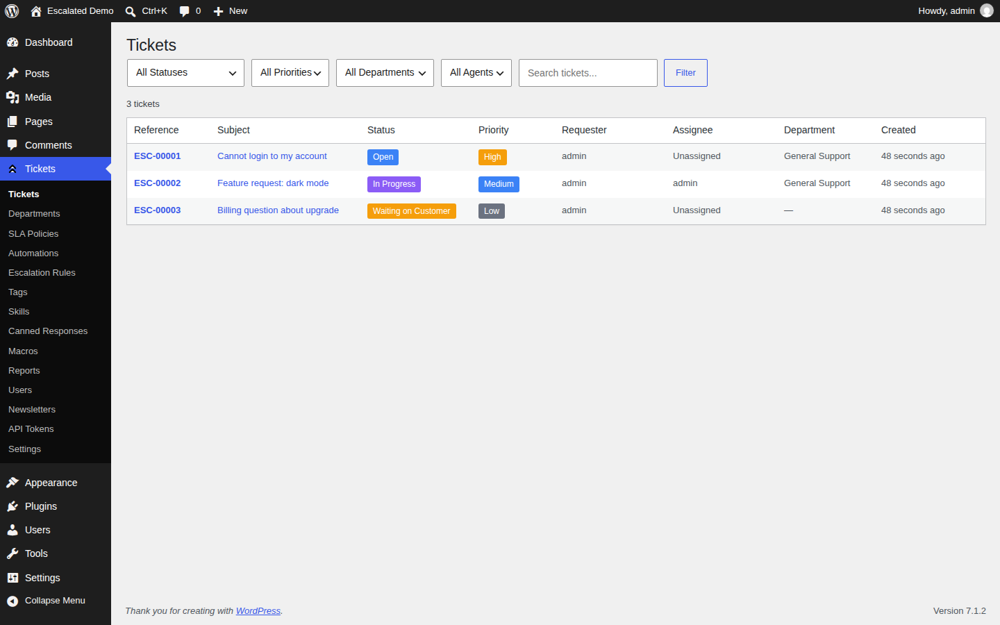
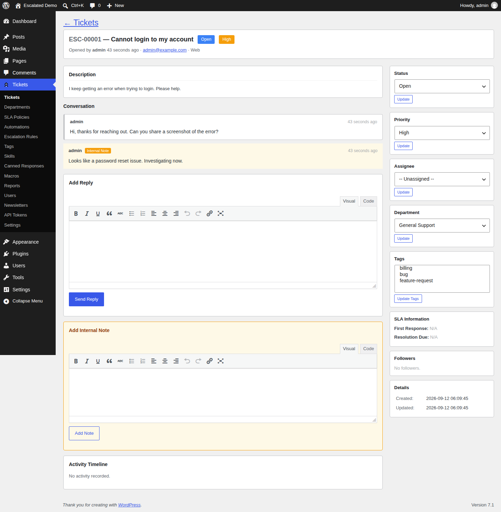
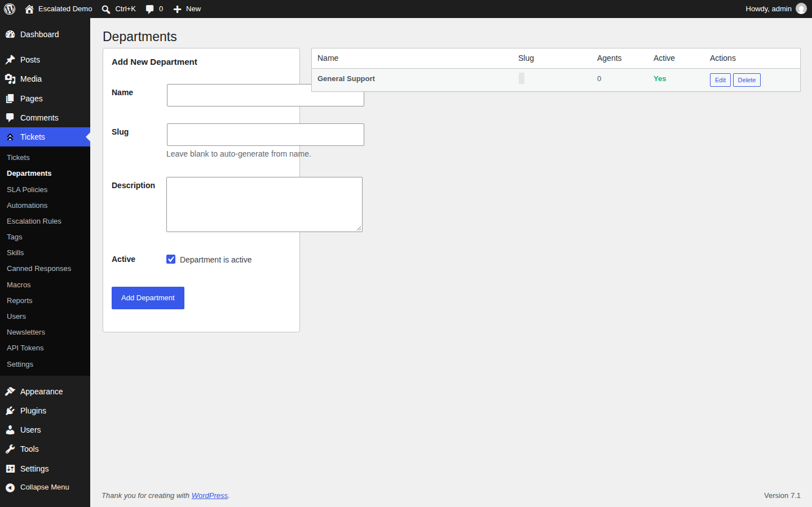
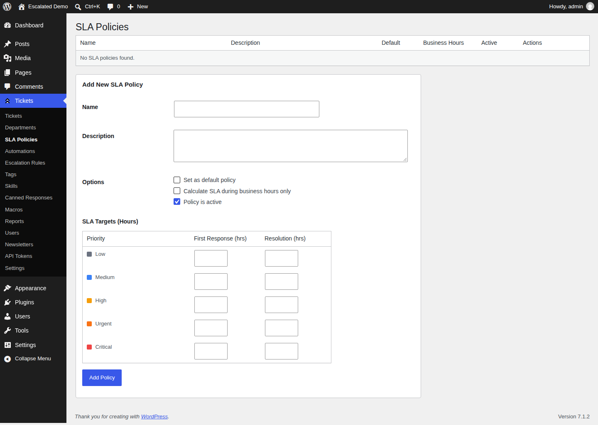
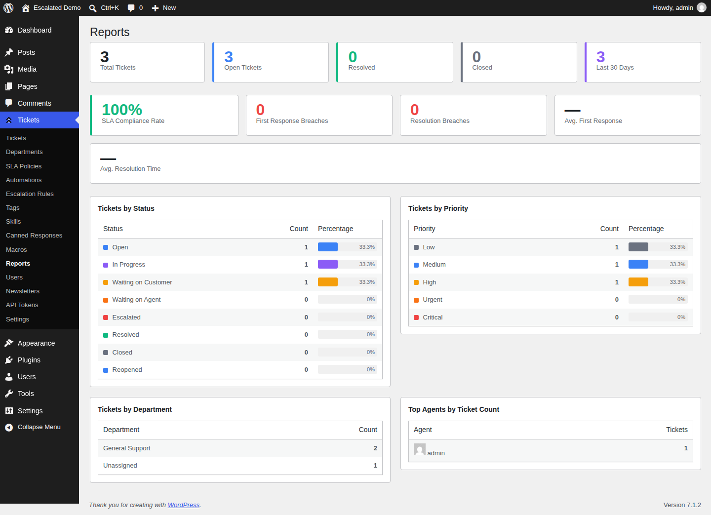
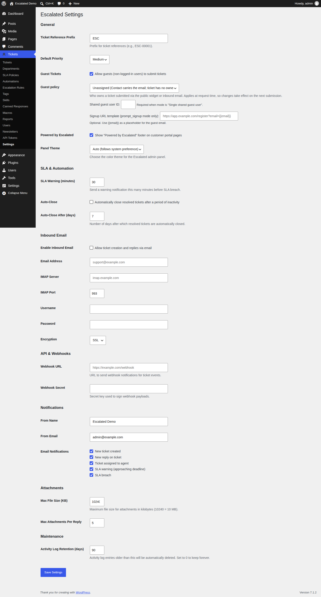
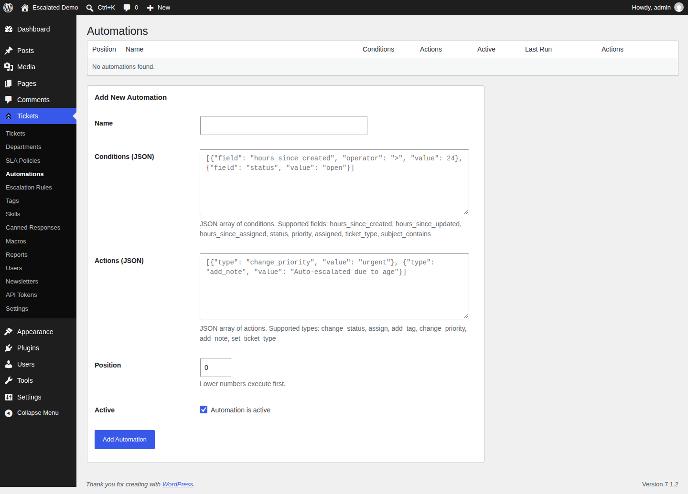
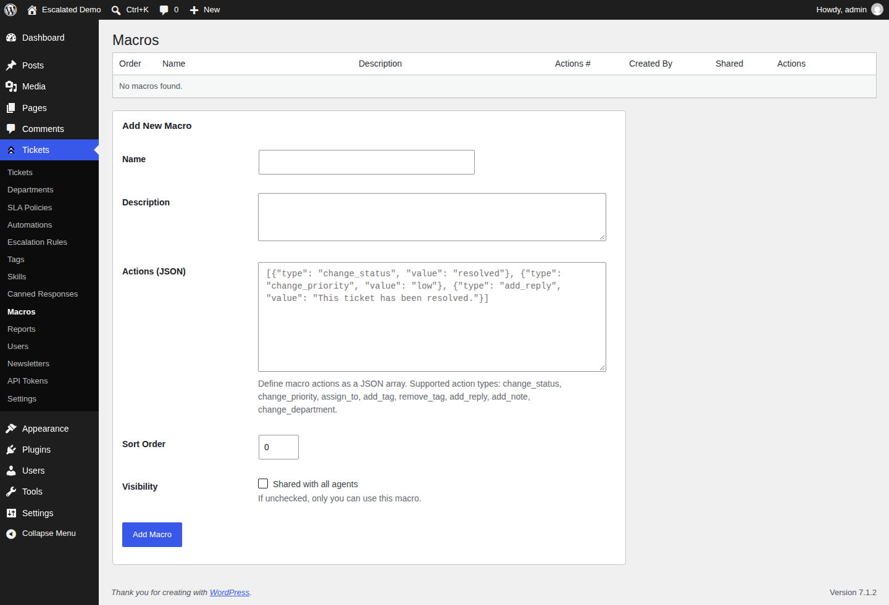

<p align="center">
  <a href="docs/translations/README.ar.md">العربية</a> •
  <a href="docs/translations/README.de.md">Deutsch</a> •
  <b>English</b> •
  <a href="docs/translations/README.es.md">Español</a> •
  <a href="docs/translations/README.fr.md">Français</a> •
  <a href="docs/translations/README.it.md">Italiano</a> •
  <a href="docs/translations/README.ja.md">日本語</a> •
  <a href="docs/translations/README.ko.md">한국어</a> •
  <a href="docs/translations/README.nl.md">Nederlands</a> •
  <a href="docs/translations/README.pl.md">Polski</a> •
  <a href="docs/translations/README.pt-BR.md">Português (BR)</a> •
  <a href="docs/translations/README.ru.md">Русский</a> •
  <a href="docs/translations/README.tr.md">Türkçe</a> •
  <a href="docs/translations/README.zh-CN.md">简体中文</a>
</p>

# Escalated for WordPress

[](https://github.com/escalated-dev/escalated-wordpress/actions/workflows/run-tests.yml)
[](https://github.com/escalated-dev/escalated-wordpress/releases/latest)
[](https://www.php.net/)
[](https://wordpress.org/)
[](LICENSE)

A full-featured helpdesk and ticketing system for WordPress with multi-role support, SLA tracking, escalation rules, inbound email processing, macros, and a REST API. No external services required.

> **[escalated.dev](https://escalated.dev)** — Learn more, view demos, and compare Cloud vs Self-Hosted options.

## Screenshots

| Ticket List | Ticket Detail |
|:-----------:|:-------------:|
|  |  |

| Departments | SLA Policies |
|:-----------:|:------------:|
|  |  |

| Reports | Settings |
|:-------:|:--------:|
|  |  |

| Automations | Macros |
|:-----------:|:------:|
|  |  |

> Screenshots are auto-generated via Playwright on every release. See `.github/workflows/screenshots.yml`.

## Download

[](https://github.com/escalated-dev/escalated-wordpress/releases/latest)

- Latest plugin package: [escalated.zip](https://github.com/escalated-dev/escalated-wordpress/releases/latest/download/escalated.zip)
- All releases: [Releases](https://github.com/escalated-dev/escalated-wordpress/releases)

## Features

- Ticket management with threaded conversations, internal notes, and activity timeline.
- Custom support roles: `escalated_admin` and `escalated_agent`.
- Department-based routing and assignment workflows.
- SLA policies with first-response and resolution targets.
- Automated escalation rules and scheduled SLA checks.
- Customer-facing frontend ticket pages via shortcodes.
- Guest ticket submission and secure guest ticket access.
- Inbound email ingestion via Mailgun, Postmark, and Amazon SES webhooks.
- Canned responses, macros, and tag management.
- Bearer token REST API with per-token abilities and rate limiting.
- Attachment support with configurable upload limits.
- Satisfaction ratings and reporting views.

## Requirements

- WordPress `6.0+`
- PHP `8.1+`

## Installation

1. Place this plugin in your WordPress plugins directory:
   - `wp-content/plugins/escalated`
2. Activate **Escalated** from the WordPress Plugins screen.
3. Go to **Escalated** in wp-admin and configure:
   - Departments
   - SLA Policies
   - Escalation Rules
   - Settings

## Frontend Shortcodes

Use these shortcodes on WordPress pages:

- `[escalated_tickets]` - Logged-in requester ticket list.
- `[escalated_create_ticket]` - Logged-in requester new ticket form.
- `[escalated_view_ticket]` - Ticket detail view:
  - Logged-in users: expects `?ticket=ESC-123`
  - Guests: expects `?guest_token=<token>`
- `[escalated_guest_create]` - Guest ticket creation form (if enabled in settings).

## REST API

- Namespace: `/wp-json/escalated/v1`
- Auth: `Authorization: Bearer <api-token>`
- Default rate limit: `60` requests/minute per token (configurable via `api_rate_limit` setting)

Main route groups:

- `/auth/validate`
- `/tickets`
- `/departments`
- `/tags`
- `/canned-responses`
- `/macros`
- `/agents`
- `/dashboard`
- `/admin/api-tokens`
- `/admin/tickets/{ref}/subjects` (attach/detach ticket subjects)

## Ticket subjects

A ticket has a **requester** (who raised it) and a **subject line** (free text).
Tickets can also be *about* host-app entities — a project, customer, or asset —
that are not people. Attach them as **subjects** so agents see context and can
link into your app.

WordPress does not own those models. Register allowed type strings and resolve
each `(type, id)` via a filter:

```php
// Allow attaching via the agent REST API (empty list disables API attach).
update_option('escalated_ticket_subject_types', ['project', 'customer']);

add_filter('escalated_resolve_ticket_subject', function ($subject, $type, $id) {
    if ($type === 'project') {
        $post = get_post((int) $id);
        if (! $post || $post->post_type !== 'project') {
            return null;
        }

        return new class ($post) implements \Escalated\Contracts\TicketSubject {
            public function __construct(private \WP_Post $post) {}

            public function ticketSubjectTitle(): string
            {
                return $this->post->post_title;
            }

            public function ticketSubjectSubtitle(): ?string
            {
                return 'Project';
            }

            public function ticketSubjectUrl(): ?string
            {
                return get_permalink($this->post);
            }

            public function ticketSubjectColor(): ?string
            {
                return null;
            }

            public function ticketSubjectIcon(): ?string
            {
                return 'folder';
            }
        };
    }

    return $subject;
}, 10, 3);
```

Programmatic attach/detach/sync (idempotent on `ticket_id` + `type` + `id`):

```php
use Escalated\Services\TicketSubjectService;

TicketSubjectService::attach($ticket_id, 'project', '42', 'project');
TicketSubjectService::detach($ticket_id, 'project', '42');
TicketSubjectService::sync($ticket_id, [
    ['type' => 'project', 'id' => '42', 'role' => 'primary'],
    ['type' => 'customer', 'id' => '7'],
]);
```

Serialized on each ticket as `subjects[]`:

`{ type, id, role, title, subtitle, url, color, icon, missing }`

(`title` falls back to `type#id` when the resolver returns null.)

Admin REST (logged-in user with `escalated_ticket_edit`):

- `POST /wp-json/escalated/v1/admin/tickets/{ref}/subjects` — body: `type`, `id`, optional `role`
- `DELETE /wp-json/escalated/v1/admin/tickets/{ref}/subjects/{link_id}`

## Custom Ticket Actions

Host plugins can add custom buttons to the agent ticket screen and handle clicks
with normal WordPress hooks. Register actions via the `escalated_ticket_actions`
filter:

```php
add_filter('escalated_ticket_actions', function (array $actions): array {
    $actions[] = [
        'key' => 'sync-crm',
        'label' => 'Sync CRM',
        'variant' => 'primary',           // primary | secondary | danger
        'confirmation' => 'Sync this ticket to the CRM?',
        'metadata' => ['icon' => 'refresh-cw'],
        // 'visible' / 'enabled' may be bool or callable($ticket, $user_id)
        'enabled' => fn ($ticket, $user_id) => empty($ticket->metadata['crm_synced']),
    ];

    return $actions;
});
```

Visible actions appear on the ticket detail response as `custom_actions` (each
with a `url` and `method`). Triggering one
(`POST /wp-json/escalated/v1/tickets/{ref}/actions/{key}`) validates the action
is visible (404) and enabled (403), then fires the
`escalated_ticket_action_triggered` hook:

```php
add_action('escalated_ticket_action_triggered', function ($ticket, $action_key, $user_id, $payload, $metadata) {
    if ($action_key !== 'sync-crm') {
        return;
    }
    // your handler
}, 10, 5);
```

Escalated also records an internal note on the ticket whenever an action fires,
for auditability.

## Inbound Email Webhooks

Inbound route pattern:

- `POST /wp-json/escalated/v1/inbound/{adapter}`

Supported adapters:

- `mailgun`
- `postmark`
- `ses`

## Scheduled Tasks (WP-Cron)

On activation, Escalated schedules:

- `escalated_check_sla` (every minute)
- `escalated_evaluate_escalations` (every 5 minutes)
- `escalated_auto_close` (daily)
- `escalated_purge_activities` (weekly)

## Translations

Escalated for WordPress consumes translations from the central
[`escalated-dev/locale`](https://github.com/escalated-dev/escalated-locale)
Composer package, which is the single source of truth for translations
across every Escalated host plugin.

At runtime the plugin loads translations in two layers (later layer wins):

1. **Central** — `vendor/escalated-dev/locale/languages/escalated-{locale}.mo`
   (installed automatically via `composer install`).
2. **Local overrides** — `languages/overrides/escalated-{locale}.mo`
   (drop your own compiled `.mo` here to override individual entries
   without forking the central package).

If the central package is not yet installed, the plugin falls back to
the legacy in-tree `languages/*.po`/`*.mo` files so existing sites keep
working.

To submit translation fixes, open a PR against
[`escalated-dev/escalated-locale`](https://github.com/escalated-dev/escalated-locale).
Do **not** edit the in-tree `.po` files — they exist only as a fallback
and will be removed once the central package reaches a stable release.

## Development

Install dependencies:

```bash
composer install
```

Run tests (WordPress test suite required):

```bash
vendor/bin/phpunit -c phpunit.xml.dist
```

If needed, set `WP_TESTS_DIR` to your local WordPress tests library path before running PHPUnit.

## Also Available For

- **[Escalated for Laravel](https://github.com/escalated-dev/escalated-laravel)** — Laravel Composer package
- **[Escalated for Rails](https://github.com/escalated-dev/escalated-rails)** — Ruby on Rails engine
- **[Escalated for Django](https://github.com/escalated-dev/escalated-django)** — Django reusable app
- **[Escalated for AdonisJS](https://github.com/escalated-dev/escalated-adonis)** — AdonisJS v6 package
- **[Escalated for Filament](https://github.com/escalated-dev/escalated-filament)** — Filament v3 admin panel plugin
- **[Escalated for WordPress](https://github.com/escalated-dev/escalated-wordpress)** — WordPress plugin (you are here)
- **[Shared Frontend](https://github.com/escalated-dev/escalated)** — Vue 3 + Inertia.js UI components

## License

MIT
